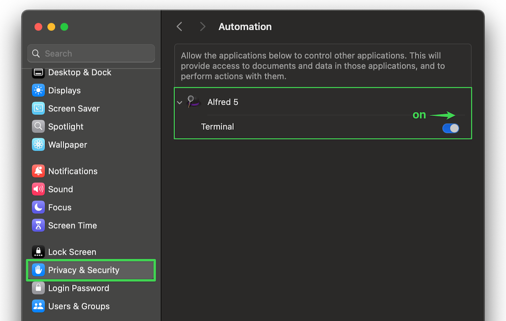

# PathFind

**PathFind** is a workflow that aims to quickly and thoroughly search your filesystem for files and folders matching keyword(s) in *any part* of the filename or enclosing path.

This means that if you search for “annual report 2024”, both of the files below would appear in the results:

- /Users/joe/Downloads/Annual **Report**s/for review/**2024**-version1.pdf
- /Users/joe/Desktop/Shareholder **report** (**Annual**) - **2024**.docx

Searches are case-insensitive, and the order in which you enter your search terms is not important. The search terms can be plain strings or [regular expressions](https://regex101.com/r/QmVP21/1). The workflow **does not rely on Spotlight** to provide its results.

You can pass *quoted strings* to be more explicit with your queries, e.g. "annual report" will NOT match a file named "annual sales report". Only **double-quotes** are considered—single-quotes are parsed as normal punctuation. Non-quoted strings will be split on spaces (which has always been the case).

## Configuration

You can customize various options via the Configure Workflow button, or by activating the `:pf` keyword. Most are self-explanatory, I will attempt to better document them in the near future.

The most important thing to configure are the **Paths** (include, exclude, etc). Enter one path per line. Trailing slashes are not required. For example:

```
~/Downloads
~/Desktop
~/Documents
~/Library/CloudStorage
/Volumes/development/area51
```

Another potentially useful section is **Path substitutions**. Here, you can specify a list of pathnames or partial pathnames to be translated (typically _shortened_) so that deeply-nested filenames will be more visible in the subtitles. You specify the "real" path substring on the left, and the shortened "display" name on the right, separated by the pipe character `|`.

For example, you might want to shorten a path like **~/Documents/Book Reports/2025/Biology 201** to just **📕BR2025**. To do that, you would configure that area as:

```
~/Documents/Book Reports/2025/Biology 201|📕2025
```

## Usage

Activate one of the trigger keywords:
- `pf` for normal mode
- `pfd` to search Folders (directories) only
- `pff` to search Files only
- `pfc` to search exclusively in the current active (frontmost) Finder window (its path does NOT need to be included in your workflow config search scope ahead of time)

You can also leverage Spotlight **in addition to** the filename-based search capabilities! To use Spotlight to query for files based on their *contents*, prefix your search term(s) with `in:`. For example, to find PDF files with the word "contract" in the filename, and the words "agreed" and "November" in the *contents*, use Alfred query `contract pdf in:agreed in:november` (the Spotlight terms are also case-insensitive).

## CLI

The workflow comes with a commandline tool that can be run outside of Alfred, if you ever find the need search from a Terminal. The script name is `pathfind.sh` and you can conveniently create a symlink to it at `/usr/local/bin` by running this workflow with the trigger keyword `:pfcli`.

During the installation, you may be prompted for your password so the workflow can create the `/usr/local/bin` directory and create the symlink so the command is available in your shell. You may also be prompted to allow Alfred to "control Terminal.app" — you should allow this so that the final Terminal Command step can complete.

After it's installed, you can type `pathfind <word1> [word2...]` from any shell to get the results in text format.



## Prerequisites

Alfred 5.5 or higher is required.

The workflow requires a few small binaries to work its magic:
- `fd` for fast, multithreaded filesystem searching
- `gawk` for case-insensitive pattern/regex matching of filenames
- `jq` for JSON processing

The workflow will warn you if these are not detected, and offer to install them for you. If you prefer, they can be installed with a single [Homebrew](https://brew.sh/) command run from Terminal:

```
brew install fd gawk jq
```

## ⚠️Potential Gotchas

- Make sure your defined keywords do not conflict with any from Alfred's native Features > File Search area!
- Enabling the **Follow symlinks** option can significantly slow down searches. If you need this option but experience poor performance, try adjusting **Max depth**, or use a smaller search scope (fewer folders, or more specific query)

## Inspiration

The workflow was inspired by [this post](https://www.alfredforum.com/topic/22886-locating-a-document-by-searching-for-words-that-are-in-the-documents-filepath/). Thank you @achieve927 for the idea!
